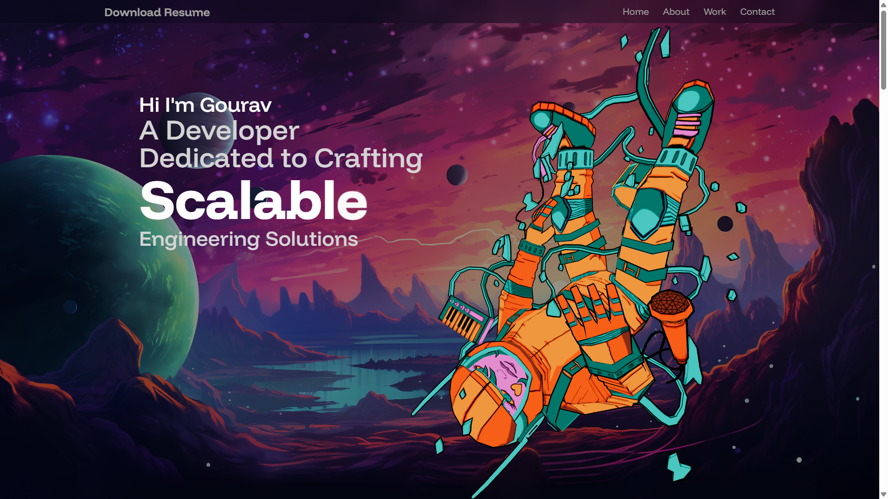

# 🌐 Gourav's Portfolio

A modern, responsive developer portfolio showcasing my projects, skills, and experience. Built with a focus on performance, clean UI, and smooth animations.

🔗 **Live Website:** https://gouravez.vercel.app/

---

## 🚀 Features

* ⚡ Fully responsive design (mobile + desktop)
* 🎨 Clean and modern UI
* 🎬 Smooth animations using Motion
* 📄 Downloadable resume
* 📂 Project showcase section
* 📬 Contact section

---

## 🛠️ Tech Stack

* **Frontend:** React.js
* **Styling:** Tailwind CSS
* **Animations:** Motion
* **Deployment:** Vercel

---

## 📸 Preview



---

## 📁 Folder Structure

```
GOURAVEZ-PORTFOLIO/ │ 
├── public/ 
│ ├── assets/ 
│ ├── models/ 
│ └── resume.pdf 
│ 
├── src/ 
│ ├── components/ 
│ ├── constants/ 
│ ├── lib/ 
│ ├── sections/ 
│ ├── App.jsx 
│ ├── main.jsx 
│ └── index.css 
│ 
├── index.html 
├── package.json 
├── vite.config.js 
└── README.md
```

---

## ⚙️ Installation & Setup

Clone the repository:

```bash
git clone https://github.com/your-username/your-repo-name.git
cd your-repo-name
```

Install dependencies:

```bash
npm install
```

Run the development server:

```bash
npm run dev
```

---

## 📄 Resume

You can download my resume directly from the website or here:

👉 [Download Resume](./public/resume.pdf)

---

## 📬 Contact

Feel free to reach out:

* 📧 Email: [junejagourav2006@gmail.com](mailto:junejagourav2006@example.com)
* 💼 LinkedIn: https://linkedin.com/in/gouravez

---

## ⭐ Acknowledgements

* Inspired by modern developer portfolios
* Built with ❤️ using React and Tailwind

---

## 📌 Note

If you like this project, consider giving it a ⭐ on GitHub!

---
